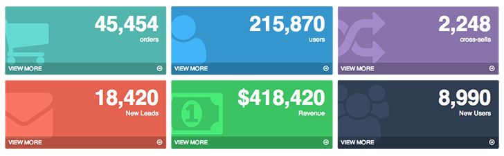

# &lt;app-color-card&gt;

> A web component to show a simple color card of data.

## How-to
```html
<app-color-card view_more></app-color-card>
```



## License
Licensed under the MIT license.

Copyright (c) 2014 [TheControlGroup](http://www.thecontrolgroup.com).
